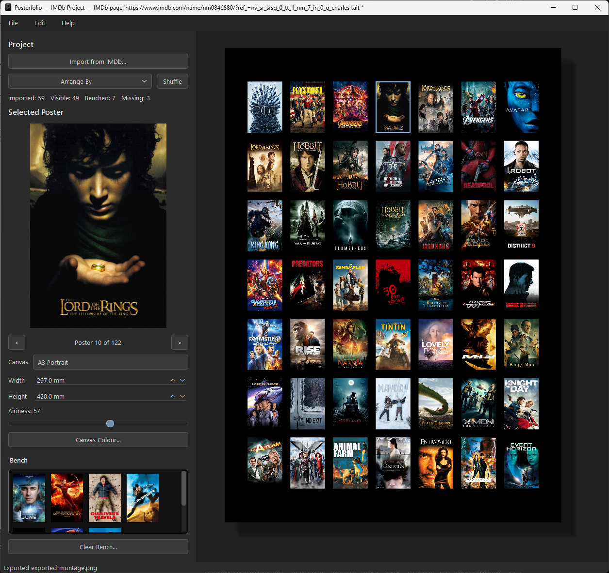
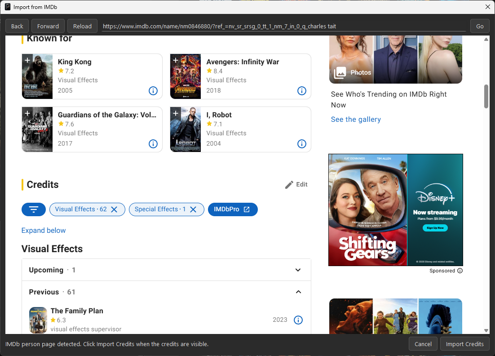
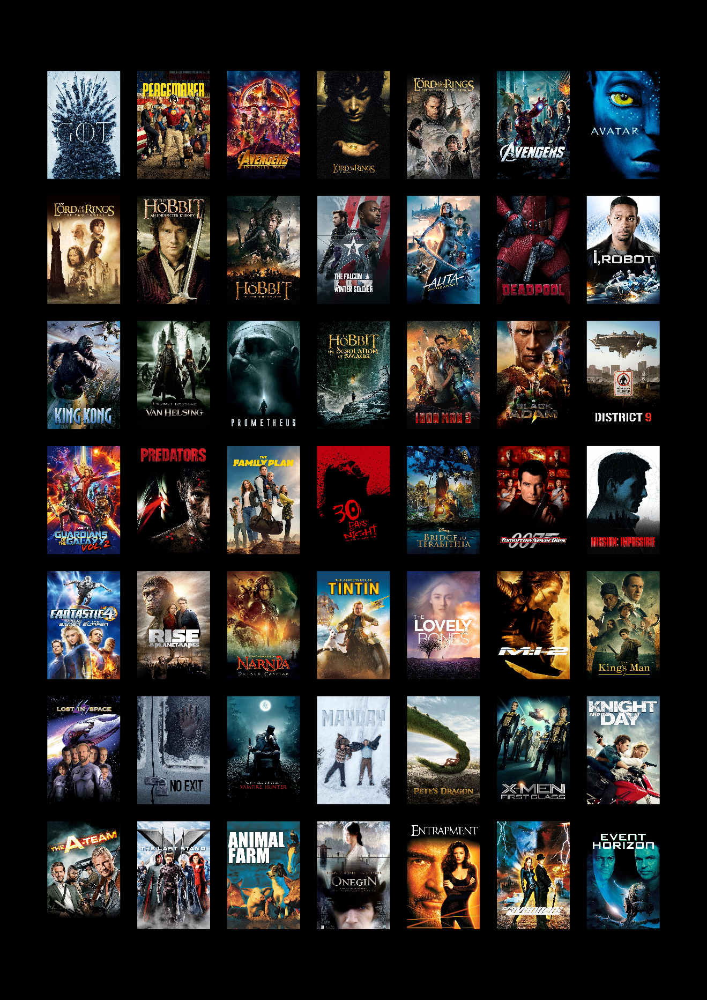

<div align="center">


<br>

[](LICENSE)
[](https://www.python.org/)
[](https://doc.qt.io/qtforpython-6/)
[](#project-status)

</div>

## Create a filmography you can hang on the wall

Posterfolio is a desktop application that turns an IMDb filmography into a polished, high-resolution poster montage.

Import acting or crew credits, retrieve poster artwork through TMDb, choose alternate designs, arrange the collection, bench unwanted titles, and export a print-ready image or PDF.



## From IMDb to finished artwork

### 1. Import the filmography

Posterfolio includes an integrated IMDb browser. Open a person's IMDb page, make the required credits visible, and import them directly into the project.



### 2. Design the montage

Posterfolio automatically builds a poster grid and provides tools to refine it:

- browse alternate poster artwork;
- drag posters between the canvas and Bench;
- select and move multiple titles;
- sort chronologically, by popularity, or by box office;
- shuffle the layout;
- change canvas size, aspect ratio, colour, and spacing;
- save the result as an editable Posterfolio project.

### 3. Export a print-ready result

Posterfolio renders from the downloaded source artwork rather than enlarging the interface thumbnails. Export to PNG, JPEG, TIFF, or PDF at a size suitable for printing, framing, presentation, or sharing.



## Features

- **IMDb import** — capture a person's filmography from the embedded browser.
- **Automatic TMDb artwork** — find poster candidates for imported titles.
- **Poster variants** — browse and choose alternative artwork.
- **Interactive editing** — drag, swap, multi-select, bench, promote, and delete titles.
- **Flexible canvas** — common print and display presets plus custom dimensions.
- **Adjustable Airiness** — control the balance between poster size and spacing.
- **Editable projects** — save and reopen `.pmd` project files.
- **High-resolution export** — render PNG, JPEG, TIFF, and PDF output.
- **Source-aware rendering** — report practical export limits from the available artwork.
- **Dark desktop interface** — built with Python, PySide6, and Qt.

## Installation

### Windows

A standalone Windows installer is being prepared for the first public release.

### macOS

A native macOS application bundle and installer image are also planned.

### Run from source

#### Requirements

- Python 3.13 or newer
- A free TMDb account
- A TMDb **API Read Access Token**

#### Windows

```powershell
git clone https://github.com/cemtait/Posterfolio.git
cd Posterfolio

py -3.13 -m venv .venv
.\.venv\Scripts\Activate.ps1

python -m pip install --upgrade pip
pip install -e .
python -m playwright install chromium

python -m poster_montage_designer
```

#### macOS

```bash
git clone https://github.com/cemtait/Posterfolio.git
cd Posterfolio

python3.13 -m venv .venv
source .venv/bin/activate

python -m pip install --upgrade pip
pip install -e .
python -m playwright install chromium

python -m poster_montage_designer
```

## TMDb setup and secret handling

Posterfolio uses TMDb to locate poster artwork.

1. Create or sign in to a TMDb account.
2. Open the API section of the TMDb account settings.
3. Copy the long value labelled **API Read Access Token**.
4. In Posterfolio, choose **Edit → Settings…**.
5. Paste the token and save.

The personal settings file is deliberately excluded from Git:

```text
config/settings.json
```

A safe blank template is included:

```text
config/settings.example.json
```

Never commit a real TMDb token.

## Basic workflow

1. Choose **File → Import from IMDb…**.
2. Navigate to the required IMDb person page.
3. Expand the filmography when needed.
4. Press **Import Credits**.
5. Review artwork and choose preferred poster variants.
6. Arrange the montage and Bench titles that should not appear.
7. Select the intended canvas size and tune Airiness.
8. Save the editable `.pmd` project.
9. Choose **File → Export…** for the final artwork.

## Keyboard and mouse shortcuts

- **F1** — open the in-application User Guide.
- **F** — fit the page to the window when the canvas has focus.
- **Mouse wheel** — zoom.
- **Middle-mouse drag** — pan.
- **Ctrl-click** — select multiple posters.
- **Undo / Redo** — reverse or restore project edits.

## Repository structure

```text
Posterfolio/
├── .github/
│   └── ISSUE_TEMPLATE/
├── config/
│   └── settings.example.json
├── docs/
│   └── images/
├── packaging/
├── src/
│   └── poster_montage_designer/
├── tools/
├── CHANGELOG.md
├── CONTRIBUTING.md
├── LICENSE
├── pyproject.toml
├── README.md
└── requirements.txt
```

## Project status

Posterfolio is functional and is now being prepared for its first packaged release.

The next milestones are:

- standalone Windows installer;
- native macOS application package;
- GitHub Release downloads;
- installer and packaging documentation;
- optional automatic update checking.

## Contributing and feedback

Bug reports and feature ideas are welcome through GitHub Issues.

Before opening an issue, please check whether the same problem or suggestion has already been reported. For development setup and contribution guidance, see [CONTRIBUTING.md](CONTRIBUTING.md).

## Credits and data sources

Posterfolio was designed and written by **Charles Tait**.

It is built with Python, PySide6, Qt, and Playwright.

Poster images and metadata are provided through [The Movie Database](https://www.themoviedb.org/). IMDb is used to identify filmography titles.

Posterfolio is an independent project and is not endorsed or certified by TMDb or IMDb.

## License

Posterfolio is released under the [MIT License](LICENSE).
